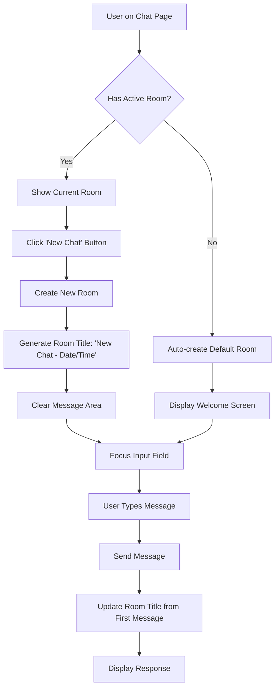
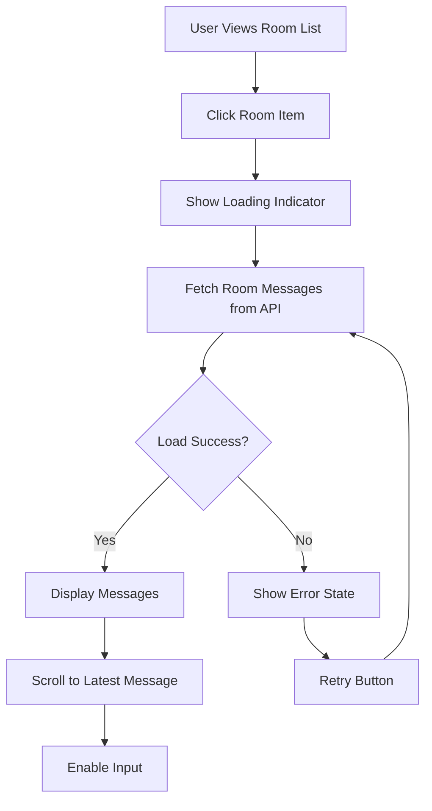
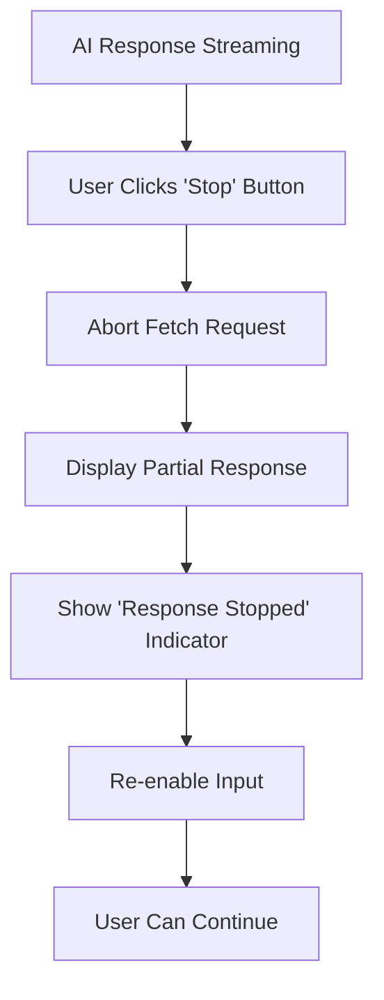
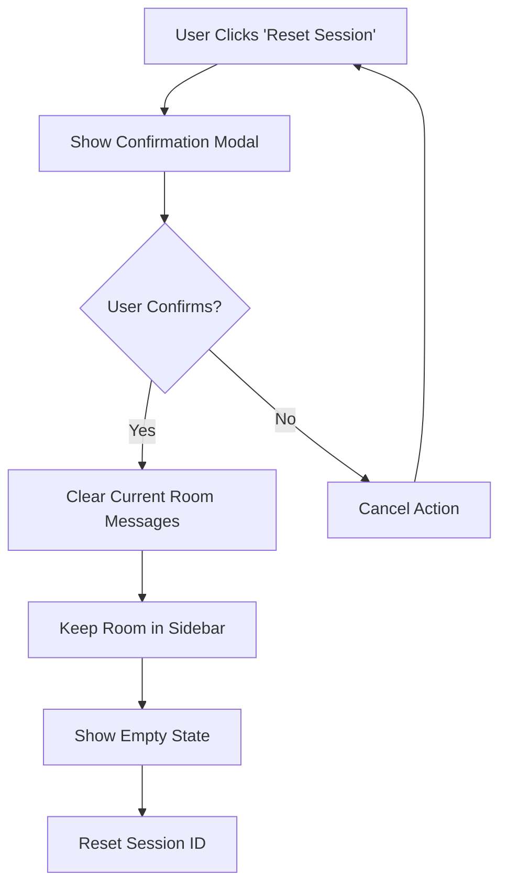
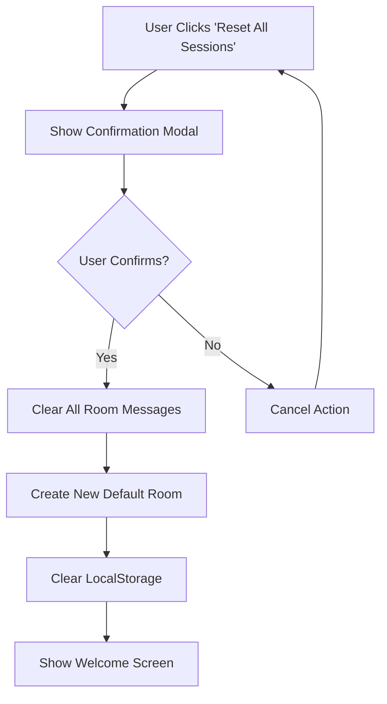
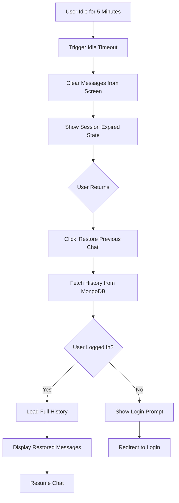

# CareGuide Chat System - Comprehensive UX Specification

**Version:** 2.0
**Date:** 2025-11-26
**Author:** UX Design Team
**Status:** Ready for Implementation

---

## Table of Contents

1. [Executive Summary](#1-executive-summary)
2. [Current State Analysis](#2-current-state-analysis)
3. [Design Goals](#3-design-goals)
4. [Information Architecture](#4-information-architecture)
5. [User Flows](#5-user-flows)
6. [Component Layout & Wireframes](#6-component-layout--wireframes)
7. [Interaction Patterns](#7-interaction-patterns)
8. [Accessibility Considerations](#8-accessibility-considerations)
9. [Technical Integration](#9-technical-integration)
10. [Mobile Responsiveness](#10-mobile-responsiveness)
11. [Implementation Roadmap](#11-implementation-roadmap)

---

## 1. Executive Summary

### 1.1 Overview
This document specifies the complete redesign of the CareGuide chat system to support multiple conversation management, session control, and improved user experience. The new design transforms the chat from a single-thread interface to a comprehensive conversation management system.

### 1.2 Key Features
- **Multi-room chat management** - Organize conversations into separate rooms
- **Session control** - Start new chats, reset sessions, stop responses
- **Enhanced navigation** - Seamless switching between conversations
- **Agent specialization** - Auto-routing, Medical/Welfare, Nutrition, Research
- **Data persistence** - Reliable chat history retrieval and storage
- **Streaming controls** - Stop AI responses mid-generation

---

## 2. Current State Analysis

### 2.1 Existing Implementation

**Frontend Components:**
- `ChatInterface.tsx` - Basic chat with session management, idle timer, history restoration
- `ChatPageEnhanced.tsx` - Enhanced chat with agent tabs (Auto, Medical/Welfare, Nutrition, Research)

**Backend APIs:**
- `/api/chat/stream` - Streaming chat responses
- `/api/chat/history` - Retrieve conversation history
- `/api/chat/rooms` - Get user's chat rooms (implemented in backend)
- `/api/chat/rooms/{room_id}/history` - Get room-specific history

**Current Architecture:**
```
Frontend (localStorage) → Backend API → MongoDB (conversation_history)
Session Management: LocalStorage + Backend SessionManager
Room Management: Backend ContextManager with room_id support
```

### 2.2 Identified Issues

1. **No visual room/session list** - Users cannot see or manage multiple conversations
2. **Limited session control** - Cannot reset individual sessions or stop responses
3. **Data retrieval issues** - Chat history not reliably loading
4. **Single conversation view** - No way to switch between conversations
5. **No streaming controls** - Cannot cancel ongoing AI responses
6. **Confusing session states** - Unclear when session expires vs. idle timeout

---

## 3. Design Goals

### 3.1 Primary Objectives

1. **Conversation Organization**
   - Enable users to manage multiple conversation threads
   - Clear visual hierarchy between rooms and messages
   - Quick access to recent conversations

2. **User Control**
   - Explicit control over session lifecycle
   - Ability to stop AI responses
   - Clear understanding of session states

3. **Data Reliability**
   - Consistent data loading across sessions
   - Clear feedback on data sync status
   - Graceful error handling

4. **Cognitive Load Reduction**
   - Minimize UI complexity
   - Progressive disclosure of features
   - Consistent interaction patterns

### 3.2 Success Metrics

- Users can create and switch between rooms in < 2 clicks
- 95% success rate in chat history restoration
- < 1 second response time for room switching
- Zero ambiguity in session state indicators

---

## 4. Information Architecture

### 4.1 Chat System Hierarchy

```
CareGuide App
├── Main Navigation
│   └── AI Chatbot (Chat Page)
│       ├── Conversation Sidebar (NEW)
│       │   ├── New Chat Button
│       │   ├── Room List
│       │   │   ├── Room Item 1
│       │   │   ├── Room Item 2
│       │   │   └── Room Item N
│       │   └── Room Management
│       │       ├── Delete Room
│       │       └── Archive Room
│       └── Chat Main Area
│           ├── Chat Header
│           │   ├── Agent Tabs (Auto, Medical/Welfare, Nutrition, Research)
│           │   ├── Current Room Title (Editable)
│           │   └── Control Buttons
│           │       ├── Stop Response
│           │       ├── Reset Session
│           │       └── Reset All Sessions
│           ├── Disclaimer Banner
│           ├── Messages Area
│           │   ├── Empty State (with suggested questions)
│           │   ├── Session Expired State
│           │   └── Message List
│           │       ├── User Messages
│           │       ├── Assistant Messages
│           │       └── Streaming Indicator
│           └── Input Area
│               ├── Profile Selector
│               ├── Image Upload (Nutrition agent)
│               ├── Text Input
│               └── Send Button
```

### 4.2 Data Organization

**Room Structure:**
```typescript
interface ChatRoom {
  room_id: string;
  user_id: string;
  title: string; // Auto-generated or user-edited
  last_message_time: Date;
  last_user_input: string;
  last_agent_response: string;
  last_agent_type: 'auto' | 'medical_welfare' | 'nutrition' | 'research';
  message_count: number;
  is_archived: boolean;
  created_at: Date;
  updated_at: Date;
}
```

**Message Structure:**
```typescript
interface Message {
  id: string;
  room_id: string;
  session_id: string;
  role: 'user' | 'assistant';
  content: string;
  agent_type?: string;
  intents?: IntentCategory[];
  confidence?: number;
  timestamp: Date;
  metadata?: {
    is_emergency?: boolean;
    streaming_complete?: boolean;
  };
}
```

### 4.3 Navigation Patterns

**Primary Navigation:**
- Main App Navigation → Chat Page
- Chat Page → [Sidebar Rooms List] + [Main Chat Area]

**Secondary Navigation:**
- Agent Tab Selection (within current room)
- Room Selection (sidebar)
- Profile Selection (input area)

**Tertiary Navigation:**
- Room Management (edit, delete, archive)
- Session Control (reset, stop)
- Message Actions (copy, bookmark - future)

---

## 5. User Flows

### 5.1 Starting a New Conversation



**Steps:**
1. User clicks "New Chat" button in sidebar
2. System creates new room with auto-generated title
3. Chat area clears and focuses on input
4. User sends first message
5. Room title updates to first user message (truncated to 30 chars)

**UI Feedback:**
- New room appears at top of sidebar with "New Chat" title
- Input field auto-focuses
- Placeholder text: "새 대화를 시작하세요..."

### 5.2 Switching Between Conversations



**Steps:**
1. User clicks room in sidebar
2. Loading indicator appears in main chat area
3. System fetches messages via `/api/chat/rooms/{room_id}/history`
4. Messages render in chronological order
5. Auto-scroll to most recent message
6. Input becomes active

**UI Feedback:**
- Selected room highlighted in sidebar
- Loading skeleton appears in chat area
- Smooth transition animation
- Error toast if load fails

### 5.3 Stopping a Response Mid-Stream



**Steps:**
1. AI begins streaming response
2. "Stop" button appears in header (red, pulsing)
3. User clicks "Stop"
4. Fetch request aborts via AbortController
5. Partial response remains visible
6. System shows "(응답이 중단되었습니다)" indicator
7. Input re-enables for next message

**UI Feedback:**
- Stop button: red background, pulsing animation
- Stopped message: grayed border, incomplete indicator
- Toast notification: "응답이 중단되었습니다"

### 5.4 Resetting Current Session



**Steps:**
1. User clicks "Reset Session" button
2. Confirmation modal appears: "현재 대화를 초기화하시겠습니까? 메시지는 삭제되지 않고 새로운 세션이 시작됩니다."
3. User confirms
4. Current room's messages clear from view
5. Room remains in sidebar with last message preview
6. New session ID generated
7. Empty state displays with suggested questions

**UI Feedback:**
- Confirmation modal with two buttons: "초기화" (primary), "취소" (secondary)
- Success toast: "세션이 초기화되었습니다"
- Smooth fade-out animation for messages

### 5.5 Resetting All Agent Sessions



**Steps:**
1. User clicks "Reset All Sessions" in dropdown menu
2. Critical confirmation modal: "모든 대화 내역을 초기화하시겠습니까? 이 작업은 되돌릴 수 없습니다."
3. User types "DELETE" to confirm
4. System clears all localStorage data
5. All rooms removed from sidebar
6. New default room created
7. Welcome screen displays

**UI Feedback:**
- Red warning modal with destructive action style
- Requires typing "DELETE" to enable confirm button
- Loading state during cleanup
- Success page redirect or confirmation

### 5.6 Restoring Chat History After Idle



**Steps:**
1. User inactive for 5 minutes
2. Messages clear from screen (not deleted from DB)
3. Session expired state displays
4. User clicks "이전 대화 복원"
5. If logged in: fetch via `/api/chat/history?user_id=X&session_id=Y`
6. Messages restore in chronological order
7. User can continue conversation

**UI Feedback:**
- Session expired icon (Clock)
- Two buttons: "이전 대화 복원" (primary), "새 대화 시작" (secondary)
- Loading state during restoration
- Success toast: "대화가 복원되었습니다"

---

## 6. Component Layout & Wireframes

### 6.1 Desktop Layout (1024px+)

```
┌────────────────────────────────────────────────────────────────────┐
│ App Header (Logo, User Menu, Notifications)                        │
├────────────────────────────────────────────────────────────────────┤
│ Main Navigation (AI Chatbot | Diet Care | Community | Trends)      │
├──────────────┬─────────────────────────────────────────────────────┤
│              │ Chat Header                                          │
│              ├─────────────────────────────────────────────────────┤
│              │ Agent Tabs: [Auto] [Medical/Welfare] [Nutrition]    │
│              │             [Research]                               │
│              ├─────────────────────────────────────────────────────┤
│  SIDEBAR     │ Room Title (Editable)                 [Stop] [⚙️]   │
│  280px       ├─────────────────────────────────────────────────────┤
│              │ Disclaimer: ⚠️ 참고용 정보, 응급시 119 연락         │
│ ┌──────────┐ ├─────────────────────────────────────────────────────┤
│ │[+ New    │ │                                                      │
│ │  Chat]   │ │                                                      │
│ └──────────┘ │                                                      │
│              │                                                      │
│ ┌──────────┐ │          MESSAGES AREA                              │
│ │ Room 1   │ │                                                      │
│ │ 투석 환자 │ │          (Empty State with                          │
│ │ 지원금...  │ │           Suggested Questions                       │
│ │ 10:45 AM │ │           OR                                        │
│ └──────────┘ │           Message Thread                            │
│ ┌──────────┐ │           OR                                        │
│ │ Room 2   │ │           Session Expired State)                    │
│ │ 저염식...  │ │                                                      │
│ │ Yesterday│ │                                                      │
│ └──────────┘ │                                                      │
│              │                                                      │
│              │                                                      │
│ ┌──────────┐ ├─────────────────────────────────────────────────────┤
│ │ Room 3   │ │ Profile: [환자(신장병 환우) ▼]                       │
│ │ CKD 연구  │ ├─────────────────────────────────────────────────────┤
│ │ 2 days   │ │ [📷] [메시지 입력...]                    [Send ➤]   │
│ └──────────┘ │                                                      │
└──────────────┴─────────────────────────────────────────────────────┘
```

### 6.2 Mobile Layout (<768px)

```
┌─────────────────────────────┐
│ [≡] CareGuide    [@] [🔔]   │
├─────────────────────────────┤
│ Current Room Title     [⚙️] │
├─────────────────────────────┤
│ [Auto][Medical][Nutrition]  │
│ [Research]                  │
├─────────────────────────────┤
│ ⚠️ 참고용 정보               │
├─────────────────────────────┤
│                             │
│                             │
│      MESSAGES               │
│      (Full Height)          │
│                             │
│                             │
│                             │
├─────────────────────────────┤
│ Profile: [환자 ▼]           │
├─────────────────────────────┤
│ [Message...]        [Send]  │
└─────────────────────────────┘

// Sidebar accessible via hamburger menu
// Slides in from left as overlay
```

### 6.3 Sidebar Component Specification

**Component:** `ChatSidebar.tsx`

**Props:**
```typescript
interface ChatSidebarProps {
  rooms: ChatRoom[];
  currentRoomId: string | null;
  onRoomSelect: (roomId: string) => void;
  onNewChat: () => void;
  onRoomDelete: (roomId: string) => void;
  isLoading: boolean;
}
```

**Layout:**
```
┌────────────────────────┐
│ ┌────────────────────┐ │
│ │  + New Chat        │ │ ← Primary Action Button
│ └────────────────────┘ │
│                        │
│ Recent Conversations   │ ← Section Header
│ ┌────────────────────┐ │
│ │ 🏥 투석 환자 지원금  │ │ ← Room Item (Selected)
│ │ "투석 비용은..."     │ │   - Title (truncated 30 chars)
│ │ Auto • 10:45 AM    │ │   - Preview (50 chars)
│ │                [×] │ │   - Agent type • Time
│ └────────────────────┘ │   - Delete button
│ ┌────────────────────┐ │
│ │ 🍽️ 저염식 레시피     │ │ ← Room Item
│ │ "저염식으로..."      │ │
│ │ Nutrition • Yester │ │
│ │                [×] │ │
│ └────────────────────┘ │
│ ┌────────────────────┐ │
│ │ 📄 CKD 최신 연구     │ │
│ │ "신장 재생..."       │ │
│ │ Research • 2 days  │ │
│ │                [×] │ │
│ └────────────────────┘ │
│                        │
│ [Show Archived (3)]    │ ← Collapsed Section
└────────────────────────┘
```

**Room Item States:**
- **Default:** White background, gray border
- **Hover:** Light gray background (#F9FAFB)
- **Selected:** Primary gradient border, white background
- **Active (typing):** Pulsing indicator dot

**Agent Type Icons:**
- Auto: ✨ (Sparkles)
- Medical/Welfare: 🏥 (Heart)
- Nutrition: 🍽️ (User - utensils)
- Research: 📄 (FileText)

### 6.4 Chat Header Component

**Component:** `ChatHeader.tsx`

**Layout:**
```
┌─────────────────────────────────────────────────────────────────┐
│ [Edit Icon] Room Title (Editable)              [Stop] [Reset ▼]│
└─────────────────────────────────────────────────────────────────┘
```

**Elements:**

1. **Editable Room Title**
   - Default: Auto-generated from first message
   - Click to edit inline
   - Max length: 50 characters
   - Enter to save, Esc to cancel
   - Updates in real-time to sidebar

2. **Stop Button** (Conditional - only during streaming)
   - Icon: X (Close)
   - Style: Red background (#EF4444), white text
   - Animation: Pulsing glow effect
   - Click: Abort current response
   - Tooltip: "응답 중단 (Ctrl+K)"

3. **Reset Dropdown Menu**
   - Icon: Settings (⚙️)
   - Menu Items:
     - "Reset Current Session" - Clears current room
     - "Reset All Sessions" - Nuclear option
     - Divider
     - "Session Info" - Shows session ID, created time

### 6.5 Messages Area Component

**Component:** `MessagesArea.tsx`

**States:**

1. **Empty State** (No messages)
```
┌───────────────────────────────┐
│         🤖 Bot Icon           │
│                               │
│  CareGuide AI와 대화를 시작    │
│         하세요                │
│                               │
│  현재 에이전트: Auto           │
│  프로필: 환자 맞춤 질문         │
│                               │
│ ┌─────────────────────────┐  │
│ │ 만성콩팥병이란 무엇인가요? │  │
│ └─────────────────────────┘  │
│ ┌─────────────────────────┐  │
│ │ 콩팥에 좋은 음식은?       │  │
│ └─────────────────────────┘  │
│ ┌─────────────────────────┐  │
│ │ 투석 시작 시기는?         │  │
│ └─────────────────────────┘  │
└───────────────────────────────┘
```

2. **Session Expired State** (After idle timeout)
```
┌───────────────────────────────┐
│         🕐 Clock Icon          │
│                               │
│    세션이 만료되었습니다        │
│                               │
│  5분간 활동이 없어 대화가       │
│    화면에서 숨겨졌습니다        │
│                               │
│ ┌─────────────────────────┐  │
│ │  📜 이전 대화 복원        │  │
│ └─────────────────────────┘  │
│ ┌─────────────────────────┐  │
│ │  ✨ 새 대화 시작          │  │
│ └─────────────────────────┘  │
│                               │
│  ⓘ 로그인하면 이전 대화를      │
│     복원할 수 있습니다         │
└───────────────────────────────┘
```

3. **Message Thread** (Active conversation)
```
┌───────────────────────────────────────┐
│ [User Avatar] 투석 환자 지원금은?      │
│               10:42 AM                │
├───────────────────────────────────────┤
│                                       │
│ 🤖 [Assistant]                        │
│ 투석 환자를 위한 의료비 지원 제도는... │
│                                       │
│ [복합 의도 감지]                       │
│ [medical_welfare] [nutrition]         │
│                                       │
│               10:42 AM                │
├───────────────────────────────────────┤
│ [User Avatar] 더 자세히 알려주세요     │
│               10:43 AM                │
├───────────────────────────────────────┤
│                                       │
│ 🤖 [Assistant - Streaming]            │
│ 네, 투석 환자 의료비 지원에 대해...    │
│ ⚪⚪⚪ 응답 생성 중...                │
│                                       │
└───────────────────────────────────────┘
```

**Message Bubble Styles:**

**User Message:**
- Background: Primary gradient (var(--gradient-primary))
- Color: White
- Border Radius: 12px 12px 4px 12px (speech bubble effect)
- Alignment: Right
- Max Width: 85% (mobile), 70% (desktop)

**Assistant Message:**
- Background: #F9FAFB (light gray)
- Color: var(--color-text-primary)
- Border: 1px solid #E0E0E0
- Border Radius: 4px 12px 12px 12px
- Alignment: Left
- Max Width: 85% (mobile), 70% (desktop)
- Icon: Bot icon (🤖) with primary color

**Streaming Indicator:**
- Three pulsing dots
- Color: Primary color (var(--color-primary))
- Animation: Sequential bounce (0.1s delay each)

### 6.6 Input Area Component

**Component:** `ChatInput.tsx`

**Layout:**
```
┌─────────────────────────────────────────────────────────────┐
│ 맞춤 정보: [환자(신장병 환우) ▼]                              │
├─────────────────────────────────────────────────────────────┤
│ [📷] [메시지 입력...]                              [Send ➤] │
└─────────────────────────────────────────────────────────────┘
```

**Elements:**

1. **Profile Selector**
   - Dropdown: 환자(신장병 환우) | 일반인(간병인) | 연구원
   - Saves to user profile
   - Affects suggested questions

2. **Image Upload** (Nutrition agent only)
   - Icon button: 📷 (Image)
   - Accepts: image/*
   - Shows preview thumbnail
   - Remove button: ❌

3. **Text Input**
   - Placeholder: "메시지 입력..." (default)
   - Placeholder (Nutrition): "음식 이미지를 업로드하거나 질문을 입력하세요..."
   - Max length: 2000 characters
   - Auto-resize: Yes (min 44px, max 200px)
   - Enter: Send (Shift+Enter: New line)

4. **Send Button**
   - Icon: Send arrow (➤)
   - Active state: Primary color background
   - Disabled state: Gray (#F3F4F6)
   - Animation: Slight scale on click

---

## 7. Interaction Patterns

### 7.1 Button States & Feedback

**Primary Action Buttons:**
```
State         | Background      | Color  | Border | Cursor
--------------+-----------------+--------+--------+---------
Default       | Primary         | White  | None   | pointer
Hover         | Primary (dark)  | White  | None   | pointer
Active        | Primary (darker)| White  | None   | pointer
Disabled      | Gray (#E5E7EB)  | #9CA3AF| None   | not-allowed
Loading       | Primary         | White  | None   | wait
```

**Secondary Action Buttons:**
```
State         | Background      | Color       | Border        | Cursor
--------------+-----------------+-------------+---------------+---------
Default       | White           | Gray        | 2px #E5E7EB   | pointer
Hover         | #F9FAFB         | Gray (dark) | 2px #D1D5DB   | pointer
Active        | #F3F4F6         | Gray (dark) | 2px #D1D5DB   | pointer
Disabled      | White           | #D1D5DB     | 2px #E5E7EB   | not-allowed
```

**Destructive Action Buttons (Delete, Reset All):**
```
State         | Background      | Color  | Border | Cursor
--------------+-----------------+--------+--------+---------
Default       | #FEE2E2         | #DC2626| None   | pointer
Hover         | #FCA5A5         | #DC2626| None   | pointer
Active        | #F87171         | White  | None   | pointer
```

### 7.2 Loading States

**Room Loading:**
- Skeleton loader in chat area
- 3 animated skeleton message bubbles
- Pulsing gray gradient

**Message Sending:**
- User message appears immediately (optimistic UI)
- AI placeholder bubble with pulsing dots
- Streaming text appears character by character

**Room List Loading:**
- Skeleton items in sidebar
- Shimmer animation effect
- Shows 5 skeleton room items

### 7.3 Error States

**Chat Load Error:**
```
┌───────────────────────────────┐
│         ⚠️ Alert Icon          │
│                               │
│   대화를 불러올 수 없습니다     │
│                               │
│   네트워크 연결을 확인하거나    │
│   잠시 후 다시 시도해주세요     │
│                               │
│ ┌─────────────────────────┐  │
│ │  🔄 다시 시도             │  │
│ └─────────────────────────┘  │
└───────────────────────────────┘
```

**Send Message Error:**
- Error toast (red): "메시지 전송 실패"
- User message remains in input
- Retry button appears
- Failed message grayed out with retry icon

**Room Creation Error:**
- Error toast: "새 대화를 시작할 수 없습니다"
- Sidebar state reverts
- Retry available

### 7.4 Confirmation Dialogs

**Reset Session Confirmation:**
```
┌─────────────────────────────────────┐
│ Reset Session                       │
├─────────────────────────────────────┤
│                                     │
│ 현재 대화를 초기화하시겠습니까?      │
│                                     │
│ 메시지는 삭제되지 않고 새로운        │
│ 세션이 시작됩니다.                  │
│                                     │
│          [Cancel]  [Reset Session]  │
└─────────────────────────────────────┘
```

**Reset All Sessions Confirmation (Destructive):**
```
┌─────────────────────────────────────┐
│ ⚠️ Reset All Sessions               │
├─────────────────────────────────────┤
│                                     │
│ 모든 대화 내역을 초기화하시겠습니까? │
│                                     │
│ 이 작업은 되돌릴 수 없습니다.        │
│                                     │
│ 계속하려면 "DELETE"를 입력하세요:    │
│ [____________]                      │
│                                     │
│          [Cancel]  [Delete All] ⚠️  │
└─────────────────────────────────────┘
```

**Delete Room Confirmation:**
```
┌─────────────────────────────────────┐
│ Delete Conversation                 │
├─────────────────────────────────────┤
│                                     │
│ "투석 환자 지원금..."를 삭제할까요? │
│                                     │
│ 이 대화의 모든 메시지가 삭제됩니다.  │
│                                     │
│          [Cancel]  [Delete] ⚠️      │
└─────────────────────────────────────┘
```

### 7.5 Toast Notifications

**Success Toasts (Green):**
- "새 대화가 시작되었습니다"
- "세션이 초기화되었습니다"
- "대화가 복원되었습니다"
- "방 제목이 수정되었습니다"

**Error Toasts (Red):**
- "메시지 전송 실패. 다시 시도해주세요"
- "대화를 불러올 수 없습니다"
- "응답 생성 중 오류가 발생했습니다"
- "세션이 만료되었습니다. 로그인해주세요"

**Info Toasts (Blue):**
- "응답이 중단되었습니다"
- "대화가 자동 저장되었습니다"
- "5분간 활동이 없어 세션이 곧 만료됩니다"

**Position:** Bottom-right (desktop), Top-center (mobile)
**Duration:** 4 seconds (success/error), 3 seconds (info)
**Dismissible:** Yes (click X or swipe)

### 7.6 Keyboard Shortcuts

| Shortcut     | Action                    | Context              |
|--------------|---------------------------|----------------------|
| Ctrl/Cmd + N | New Chat                  | Global (Chat page)   |
| Ctrl/Cmd + K | Stop Current Response     | During streaming     |
| Ctrl/Cmd + R | Reset Current Session     | With confirmation    |
| Ctrl/Cmd + E | Edit Room Title           | Focus title input    |
| Enter        | Send Message              | Input field focused  |
| Shift+Enter  | New Line                  | Input field focused  |
| Esc          | Cancel Edit/Modal         | Modal open           |
| ↑/↓          | Navigate Room List        | Sidebar focused      |
| /            | Focus Input Field         | Global               |

---

## 8. Accessibility Considerations

### 8.1 ARIA Labels & Roles

**Sidebar Navigation:**
```html
<nav aria-label="Chat rooms" role="navigation">
  <button aria-label="Create new chat" aria-controls="chat-area">
    + New Chat
  </button>

  <ul role="list" aria-label="Recent conversations">
    <li role="listitem">
      <button
        aria-label="Chat about 투석 환자 지원금, last message 10:45 AM"
        aria-current="page"  // if selected
        aria-describedby="room-1-preview"
      >
        <span>투석 환자 지원금</span>
        <span id="room-1-preview" class="sr-only">
          Preview: 투석 비용은 얼마나 지원되나요?
        </span>
      </button>
    </li>
  </ul>
</nav>
```

**Chat Messages:**
```html
<div role="log" aria-live="polite" aria-label="Chat messages">
  <article aria-label="User message at 10:42 AM">
    <p>투석 환자 지원금은?</p>
  </article>

  <article aria-label="Assistant message at 10:42 AM">
    <p>투석 환자를 위한 의료비 지원 제도는...</p>
  </article>

  <article aria-label="Assistant typing" aria-live="assertive">
    <p>응답 생성 중...</p>
  </article>
</div>
```

**Input Area:**
```html
<form role="form" aria-label="Send message">
  <label for="profile-select" class="sr-only">Select user profile</label>
  <select id="profile-select" aria-describedby="profile-hint">
    <option>환자(신장병 환우)</option>
  </select>
  <span id="profile-hint" class="sr-only">
    Choose your profile for personalized responses
  </span>

  <label for="message-input" class="sr-only">Message input</label>
  <input
    id="message-input"
    aria-label="Type your message"
    aria-describedby="input-hint"
    placeholder="메시지 입력..."
  />
  <span id="input-hint" class="sr-only">
    Press Enter to send, Shift+Enter for new line
  </span>

  <button
    type="submit"
    aria-label="Send message"
    aria-disabled="true"  // if input empty
  >
    Send
  </button>
</form>
```

### 8.2 Keyboard Navigation

**Tab Order:**
1. Main navigation
2. Sidebar: New Chat button
3. Sidebar: Room list items (sequential)
4. Chat header: Room title edit
5. Chat header: Stop button (if visible)
6. Chat header: Settings dropdown
7. Input area: Profile selector
8. Input area: Image upload (if visible)
9. Input area: Text input
10. Input area: Send button

**Focus Indicators:**
- All interactive elements: 2px solid primary color outline
- Offset: 2px from element
- Border-radius: Matches element shape
- No default browser outline (use custom)

### 8.3 Screen Reader Support

**Announcements:**

1. **New message sent:**
   - "Your message sent: [message text]"
   - "Waiting for response..."

2. **Response received:**
   - "Assistant responded: [first 50 chars]..."
   - "Response complete"

3. **Room switched:**
   - "Switched to conversation: [room title]"
   - "Loaded [X] messages"

4. **Session reset:**
   - "Session reset. Starting fresh conversation"

5. **Error occurred:**
   - "Error: [error message]. Please try again"

**Live Regions:**
- Chat messages: `aria-live="polite"`
- Streaming text: `aria-live="assertive"` (during active streaming only)
- Error messages: `aria-live="assertive"`
- Success toasts: `aria-live="polite"`

### 8.4 Color Contrast

**WCAG AAA Compliance (7:1 ratio):**

| Element              | Foreground | Background | Ratio  |
|----------------------|------------|------------|--------|
| Body text            | #1F2937    | #FFFFFF    | 12.6:1 |
| Secondary text       | #6B7280    | #FFFFFF    | 4.9:1  |
| Primary button       | #FFFFFF    | #00C8B4    | 8.2:1  |
| Link text            | #00C8B4    | #FFFFFF    | 3.8:1* |
| Error text           | #DC2626    | #FFFFFF    | 5.9:1  |
| Success text         | #059669    | #FFFFFF    | 4.7:1  |

*Underlined for additional context

**High Contrast Mode Support:**
- Forced colors CSS supported
- Border outlines on all interactive elements
- No reliance on color alone for meaning

### 8.5 Motion & Animation

**Reduced Motion Support:**
```css
@media (prefers-reduced-motion: reduce) {
  * {
    animation-duration: 0.01ms !important;
    animation-iteration-count: 1 !important;
    transition-duration: 0.01ms !important;
  }

  .skeleton-loader,
  .pulsing-dot,
  .streaming-indicator {
    animation: none !important;
  }
}
```

**Accessible Animations:**
- Skeleton loaders: Subtle opacity change (no movement)
- Streaming dots: Simple opacity pulse (no bounce in reduced motion)
- Page transitions: Instant switch (no slide/fade in reduced motion)

### 8.6 Touch Target Sizes

**Minimum Sizes (WCAG 2.5.5):**
- Buttons: 44x44px (mobile), 36x36px (desktop)
- Room list items: Full width, 56px height
- Input field: 44px height minimum
- Clickable message areas: 44x44px tap target for actions

---

## 9. Technical Integration

### 9.1 API Endpoints Required

**Existing (Working):**
- `POST /api/chat/stream` - Stream chat responses
- `GET /api/chat/history` - Get user's chat history
- `GET /api/chat/rooms` - Get user's chat rooms
- `GET /api/chat/rooms/{room_id}/history` - Get room-specific history

**New/Enhanced:**
```typescript
// Create new room
POST /api/chat/rooms
Request: {
  user_id: string;
  title?: string; // Optional, auto-generated if empty
  initial_agent?: AgentType;
}
Response: {
  room_id: string;
  session_id: string;
  title: string;
  created_at: string;
}

// Update room title
PATCH /api/chat/rooms/{room_id}
Request: {
  title: string;
}
Response: {
  room_id: string;
  title: string;
  updated_at: string;
}

// Delete room
DELETE /api/chat/rooms/{room_id}
Response: {
  success: boolean;
  message: string;
}

// Reset current session (create new session for room)
POST /api/chat/rooms/{room_id}/reset-session
Response: {
  session_id: string;
  room_id: string;
  message: string;
}

// Reset all user sessions
POST /api/chat/reset-all-sessions
Request: {
  user_id: string;
  confirmation: "DELETE"; // Safety check
}
Response: {
  success: boolean;
  sessions_cleared: number;
  message: string;
}
```

### 9.2 Frontend State Management

**React Context Structure:**
```typescript
interface ChatContextState {
  // Room management
  rooms: ChatRoom[];
  currentRoomId: string | null;
  isLoadingRooms: boolean;

  // Message management
  messages: Message[];
  isLoadingMessages: boolean;

  // Streaming state
  isStreaming: boolean;
  streamingContent: string;
  abortController: AbortController | null;

  // Session management
  currentSessionId: string | null;
  sessionExpired: boolean;

  // UI state
  isSidebarOpen: boolean; // Mobile
  selectedAgentTab: AgentType;

  // User state
  userProfile: 'general' | 'patient' | 'researcher';
}

interface ChatContextActions {
  // Room actions
  loadRooms: () => Promise<void>;
  createNewRoom: (title?: string) => Promise<void>;
  selectRoom: (roomId: string) => Promise<void>;
  updateRoomTitle: (roomId: string, title: string) => Promise<void>;
  deleteRoom: (roomId: string) => Promise<void>;

  // Message actions
  sendMessage: (content: string, image?: File) => Promise<void>;
  stopStreaming: () => void;

  // Session actions
  resetCurrentSession: () => Promise<void>;
  resetAllSessions: () => Promise<void>;
  restoreChatHistory: () => Promise<void>;

  // UI actions
  toggleSidebar: () => void;
  setAgentTab: (agent: AgentType) => void;
  updateUserProfile: (profile: 'general' | 'patient' | 'researcher') => void;
}
```

**Context Provider:**
```typescript
// src/contexts/ChatContext.tsx
export const ChatProvider: React.FC<{children: ReactNode}> = ({children}) => {
  const [state, setState] = useState<ChatContextState>(initialState);

  const actions: ChatContextActions = {
    loadRooms: async () => {
      setState(s => ({...s, isLoadingRooms: true}));
      try {
        const response = await api.get('/api/chat/rooms', {
          params: {user_id: user?.id}
        });
        setState(s => ({
          ...s,
          rooms: response.data.rooms,
          isLoadingRooms: false
        }));
      } catch (error) {
        toast.error('채팅방 목록을 불러올 수 없습니다');
        setState(s => ({...s, isLoadingRooms: false}));
      }
    },

    selectRoom: async (roomId: string) => {
      setState(s => ({...s, isLoadingMessages: true, currentRoomId: roomId}));
      try {
        const response = await api.get(`/api/chat/rooms/${roomId}/history`, {
          params: {limit: 50}
        });
        const messages = response.data.conversations.map(formatMessage);
        setState(s => ({
          ...s,
          messages,
          isLoadingMessages: false
        }));
      } catch (error) {
        toast.error('대화를 불러올 수 없습니다');
        setState(s => ({...s, isLoadingMessages: false}));
      }
    },

    stopStreaming: () => {
      if (state.abortController) {
        state.abortController.abort();
        setState(s => ({
          ...s,
          isStreaming: false,
          streamingContent: '',
          abortController: null
        }));
        toast.info('응답이 중단되었습니다');
      }
    },

    // ... other actions
  };

  return (
    <ChatContext.Provider value={{state, actions}}>
      {children}
    </ChatContext.Provider>
  );
};
```

### 9.3 LocalStorage Strategy

**Storage Keys:**
```typescript
const STORAGE_KEYS = {
  CURRENT_ROOM_ID: 'careguide_current_room_id',
  SELECTED_PROFILE: 'careguide_selected_profile',
  SIDEBAR_STATE: 'careguide_sidebar_open', // Mobile only
  DRAFT_MESSAGE: 'careguide_draft_message_{roomId}',
  LAST_VISITED: 'careguide_last_visited',
};
```

**Data Persistence:**
- Current room ID: Restore on page load
- User profile: Sync with backend, cache locally
- Draft messages: Per-room autosave (every 2 seconds)
- Sidebar state: Mobile collapsed/expanded preference

**Cache Invalidation:**
- Rooms list: Refresh on focus (stale-while-revalidate)
- Messages: Refresh on room switch
- Profile: Refresh on login/logout

### 9.4 WebSocket Integration (Future Enhancement)

**Real-time Features:**
- Live message streaming (alternative to SSE)
- Room updates (new messages in other rooms)
- Typing indicators
- Read receipts

**Connection Management:**
```typescript
// Future: Replace SSE with WebSocket
const ws = new WebSocket(`${wsUrl}/chat/${roomId}`);

ws.onmessage = (event) => {
  const data = JSON.parse(event.data);

  switch (data.type) {
    case 'message_chunk':
      appendStreamingContent(data.content);
      break;
    case 'message_complete':
      finalizeMessage(data.message);
      break;
    case 'room_update':
      updateRoomInList(data.room);
      break;
  }
};
```

---

## 10. Mobile Responsiveness

### 10.1 Breakpoints

```css
/* Mobile Small */
@media (max-width: 374px) {
  /* iPhone SE, smaller devices */
}

/* Mobile */
@media (max-width: 767px) {
  /* Default mobile layout */
  /* Sidebar as overlay */
  /* Full-width messages */
}

/* Tablet */
@media (min-width: 768px) and (max-width: 1023px) {
  /* Collapsed sidebar (icons only) */
  /* Expandable on hover */
}

/* Desktop */
@media (min-width: 1024px) {
  /* Persistent sidebar (280px) */
  /* Desktop layout */
}
```

### 10.2 Mobile Layout Adjustments

**Sidebar on Mobile:**
- Hidden by default
- Accessible via hamburger menu (≡)
- Slides in from left as full-screen overlay
- Tap outside or close button to dismiss
- Backdrop blur effect

**Agent Tabs on Mobile:**
- Horizontal scroll
- Sticky at top
- Smaller font size (12px)
- Icons only option (collapsed state)

**Messages on Mobile:**
- Full width messages (95% max-width)
- Larger touch targets (56px minimum)
- Swipe gestures (future):
  - Swipe left on room: Delete
  - Swipe right on message: Reply (future)

**Input Area on Mobile:**
- Fixed to bottom (sticky position)
- Auto-resize up to 120px
- Send button always visible
- Image preview in compact mode

### 10.3 Touch Gestures

**Implemented:**
- Tap: Select room, send message, button actions
- Long press: Room options (delete, archive)
- Scroll: Navigate messages and room list

**Future Enhancements:**
- Swipe left: Delete room
- Swipe right: Archive room
- Pull down: Refresh messages
- Pinch zoom: Message text size (accessibility)

### 10.4 Safe Areas (iOS Notch)

```css
.chat-layout {
  padding-top: env(safe-area-inset-top);
  padding-bottom: env(safe-area-inset-bottom);
  padding-left: env(safe-area-inset-left);
  padding-right: env(safe-area-inset-right);
}

.input-area {
  /* Account for iOS home indicator */
  padding-bottom: calc(16px + env(safe-area-inset-bottom));
}
```

---

## 11. Implementation Roadmap

### 11.1 Phase 1: Foundation (Week 1)

**Backend:**
- ✅ Room management endpoints
  - `POST /api/chat/rooms` - Create room
  - `PATCH /api/chat/rooms/{id}` - Update title
  - `DELETE /api/chat/rooms/{id}` - Delete room
- ✅ Session reset endpoints
  - `POST /api/chat/rooms/{id}/reset-session`
  - `POST /api/chat/reset-all-sessions`
- Database schema updates (if needed)

**Frontend:**
- Create `ChatContext.tsx` state management
- Implement `ChatSidebar.tsx` component
- Implement room list rendering
- API integration for room CRUD

**Testing:**
- Unit tests for ChatContext
- API endpoint tests
- Room creation/deletion flows

### 11.2 Phase 2: Core Features (Week 2)

**Frontend:**
- Implement `ChatHeader.tsx` with controls
- Stop streaming functionality (AbortController)
- Reset session flows with confirmations
- Room switching logic
- Message loading states

**Backend:**
- Optimize room history loading
- Implement pagination for messages
- Add room metadata (message count, last active)

**Testing:**
- Integration tests for room switching
- E2E tests for session reset
- Performance testing for message loading

### 11.3 Phase 3: Polish & UX (Week 3)

**Frontend:**
- Editable room titles
- Empty states for all scenarios
- Session expired state
- Loading skeletons
- Error states and retry logic
- Toast notifications
- Keyboard shortcuts

**Design:**
- Animation refinements
- Transition effects
- Accessibility audit
- Mobile layout optimizations

**Testing:**
- Accessibility testing (WAVE, axe)
- Cross-browser testing
- Mobile device testing
- User acceptance testing

### 11.4 Phase 4: Advanced Features (Week 4)

**Features:**
- Auto-save draft messages
- Room archiving
- Search within conversations (future)
- Export conversation (future)
- Typing indicators (WebSocket - future)

**Performance:**
- Message virtualization (react-window)
- Lazy loading for room history
- Image optimization
- Code splitting

**Monitoring:**
- Analytics events
- Error tracking (Sentry)
- Performance monitoring

---

## 12. Appendix

### 12.1 Component File Structure

```
src/
├── components/
│   ├── chat/
│   │   ├── ChatLayout.tsx         # Main layout wrapper
│   │   ├── ChatSidebar.tsx        # Sidebar with room list
│   │   ├── ChatHeader.tsx         # Header with controls
│   │   ├── MessagesArea.tsx       # Messages display
│   │   ├── ChatInput.tsx          # Input with profile selector
│   │   ├── RoomItem.tsx           # Individual room list item
│   │   ├── MessageBubble.tsx      # User/Assistant message
│   │   ├── EmptyState.tsx         # No messages state
│   │   ├── SessionExpiredState.tsx # Idle timeout state
│   │   ├── StreamingIndicator.tsx # Typing animation
│   │   └── ConfirmationModal.tsx  # Reset confirmations
│   └── ui/
│       ├── Button.tsx
│       ├── Dropdown.tsx
│       ├── Modal.tsx
│       └── Toast.tsx
├── contexts/
│   └── ChatContext.tsx            # Chat state management
├── hooks/
│   ├── useChat.tsx                # Chat context hook
│   ├── useRooms.tsx               # Room management hook
│   └── useStreamingResponse.tsx   # Streaming logic hook
├── services/
│   ├── chatApi.ts                 # Chat API calls
│   └── roomApi.ts                 # Room API calls
└── types/
    ├── chat.ts                    # Chat type definitions
    └── room.ts                    # Room type definitions
```

### 12.2 Design Tokens

**Colors:**
```css
:root {
  /* Primary */
  --color-primary: #00C8B4;
  --color-primary-dark: #00b3a1;
  --color-primary-light: #33d4c2;

  /* Gradients */
  --gradient-primary: linear-gradient(135deg, #00C8B4 0%, #00A896 100%);

  /* Text */
  --color-text-primary: #1F2937;
  --color-text-secondary: #6B7280;
  --color-text-tertiary: #9CA3AF;

  /* Background */
  --color-bg-primary: #FFFFFF;
  --color-bg-secondary: #F9FAFB;
  --color-bg-tertiary: #F3F4F6;

  /* Borders */
  --color-border-light: #E5E7EB;
  --color-border-medium: #D1D5DB;
  --color-border-dark: #9CA3AF;

  /* Status */
  --color-success: #059669;
  --color-error: #DC2626;
  --color-warning: #F59E0B;
  --color-info: #3B82F6;
}
```

**Typography:**
```css
:root {
  /* Font Families */
  --font-primary: 'Pretendard', -apple-system, BlinkMacSystemFont, 'Segoe UI', sans-serif;
  --font-mono: 'SF Mono', 'Monaco', 'Courier New', monospace;

  /* Font Sizes */
  --text-xs: 0.75rem;    /* 12px */
  --text-sm: 0.875rem;   /* 14px */
  --text-base: 1rem;     /* 16px */
  --text-lg: 1.125rem;   /* 18px */
  --text-xl: 1.25rem;    /* 20px */
  --text-2xl: 1.5rem;    /* 24px */

  /* Font Weights */
  --font-normal: 400;
  --font-medium: 500;
  --font-semibold: 600;
  --font-bold: 700;

  /* Line Heights */
  --leading-tight: 1.25;
  --leading-normal: 1.5;
  --leading-relaxed: 1.75;
}
```

**Spacing:**
```css
:root {
  --spacing-1: 0.25rem;  /* 4px */
  --spacing-2: 0.5rem;   /* 8px */
  --spacing-3: 0.75rem;  /* 12px */
  --spacing-4: 1rem;     /* 16px */
  --spacing-5: 1.25rem;  /* 20px */
  --spacing-6: 1.5rem;   /* 24px */
  --spacing-8: 2rem;     /* 32px */
  --spacing-10: 2.5rem;  /* 40px */
  --spacing-12: 3rem;    /* 48px */
}
```

**Border Radius:**
```css
:root {
  --radius-sm: 0.25rem;  /* 4px */
  --radius-md: 0.5rem;   /* 8px */
  --radius-lg: 0.75rem;  /* 12px */
  --radius-xl: 1rem;     /* 16px */
  --radius-full: 9999px; /* Circular */
}
```

### 12.3 Figma Design Files

**Component Library:**
- Chat Sidebar Component
- Message Bubble Variants
- Input Area Variations
- Modal Templates
- Button States
- Loading States

**Screens:**
- Desktop: Chat Page (Empty, Active, Expired)
- Mobile: Chat Page (Sidebar Open, Chat Active)
- Tablet: Chat Page (Collapsed Sidebar)

**Prototype Flows:**
- New Chat Creation
- Room Switching
- Session Reset
- Stop Response

---

## 13. Questions & Decisions Log

### 13.1 Resolved Decisions

**Q: Should room deletion be permanent or soft delete?**
**A:** Soft delete (archive) by default, with permanent delete in settings. Prevents accidental data loss.

**Q: How many rooms to show in sidebar before pagination?**
**A:** Show top 20 recent rooms, with "Show More" button. Use virtual scrolling for 100+ rooms.

**Q: Should we auto-create room on first message or require explicit creation?**
**A:** Auto-create default room on first visit. "New Chat" creates additional rooms explicitly.

**Q: How to handle room title updates?**
**A:** Auto-generate from first user message (first 30 chars). User can edit by clicking title.

**Q: Session reset vs. message clear - what's the difference?**
**A:** Session reset creates new session_id, clears context. Messages remain in DB but hidden. Full reset deletes all data.

### 13.2 Open Questions (For Product Team)

1. **Data Retention:** How long should deleted rooms be kept in archive before permanent deletion?
2. **Concurrent Sessions:** Should users be able to have multiple browser tabs with different active rooms?
3. **Collaboration:** Future feature to share conversation rooms with other users?
4. **Export:** What format for conversation export (PDF, TXT, JSON)?
5. **Search:** Should search be global (all rooms) or per-room?

---

## 14. Success Criteria

### 14.1 User Experience Metrics

- **Task Completion Rate:** 95%+ for core flows (new chat, switch room, send message)
- **Time to Task:**
  - Create new chat: < 2 seconds
  - Switch rooms: < 1 second
  - Send message: < 500ms (optimistic UI)
- **Error Rate:** < 2% for chat operations
- **User Satisfaction (SUS Score):** 80+ (Excellent)

### 14.2 Technical Metrics

- **Page Load Time:** < 2 seconds (LCP)
- **Room List Load:** < 500ms
- **Message History Load:** < 1 second for 50 messages
- **Streaming Latency:** First token < 1 second
- **API Success Rate:** 99%+
- **Accessibility Score (Lighthouse):** 95+

### 14.3 Acceptance Criteria

**Must Have (P0):**
- ✅ Create new chat rooms
- ✅ Display room list with last message preview
- ✅ Switch between rooms
- ✅ Send messages and receive responses
- ✅ Stop streaming responses
- ✅ Reset current session
- ✅ Session expiry handling
- ✅ Mobile responsive layout
- ✅ WCAG AA accessibility compliance

**Should Have (P1):**
- Edit room titles
- Delete rooms
- Room search/filter
- Keyboard shortcuts
- Error recovery
- Offline indicator

**Nice to Have (P2):**
- Room archiving
- Export conversations
- Message search
- Typing indicators
- Read receipts

---

## 15. References

### 15.1 Design Inspiration

- **ChatGPT** - Multi-conversation sidebar, session management
- **Claude.ai** - Clean message bubbles, streaming indicators
- **Slack** - Channel list, message threading
- **WhatsApp Web** - Mobile-first chat layout
- **Linear** - Command palette, keyboard shortcuts

### 15.2 Accessibility Resources

- [WCAG 2.1 Guidelines](https://www.w3.org/WAI/WCAG21/quickref/)
- [ARIA Authoring Practices Guide](https://www.w3.org/WAI/ARIA/apg/)
- [Inclusive Components](https://inclusive-components.design/)

### 15.3 Technical Documentation

- [React Context API](https://react.dev/reference/react/useContext)
- [Streaming APIs (SSE)](https://developer.mozilla.org/en-US/docs/Web/API/Server-sent_events)
- [AbortController](https://developer.mozilla.org/en-US/docs/Web/API/AbortController)
- [MongoDB Aggregation](https://www.mongodb.com/docs/manual/aggregation/)

---

**End of Document**

For implementation questions, contact:
- UX Design: [Design Team]
- Frontend: [Frontend Team Lead]
- Backend: [Backend Team Lead]
- Product: [Product Manager]
